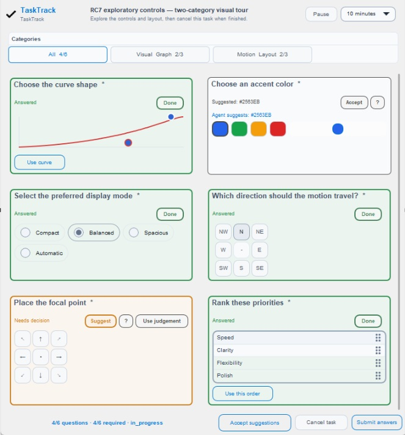

# TaskTrack

TaskTrack is a native U++ companion for AI-assisted work. It has two deliberately separate jobs:

1. **Human decisions** — durable structured human evidence when an agent cannot establish the answer from machine evidence.
2. **Project dashboards** — durable AI-maintained project state that gives a person a quick visual answer to “where are we, what is next, and what needs attention?”

The two models are intentionally separate. Dashboard state is agent-authored presentation/management state; it can link to a TaskTrack human-decision task, but it never becomes `items[].answer.data`.



## Human decisions

`TaskTrackMcp.exe` persists a decision task, opens `TaskTrackGui.exe`, and returns the structured result through the same workflow. The person does not need to return to chat and type “done” merely to wake the agent.

- 18 semantic question types.
- Native U++ controls rather than browser forms.
- Structured `answer.data` as human evidence.
- Durable writes with `.bak` recovery.
- Suggest, Clarify and explicit **Use judgement** delegation.
- Responsive measured question cards and compact agent-launched dialogs.
- Pass/Fail fast path with optional verdict note.

## Project dashboards

`TaskTrackMcp.exe` exposes both human-decision and dashboard tool families. `TaskTrackDashboardGui.exe` is the read-only native project cockpit opened by `open_dashboard`.

- Eight semantic panel types: project state, timeline, progress/objectives, next actions, attention, verification, changes and generic records.
- `UiProgressRing` for overall/project-state progress.
- TaskTrack-local `TaskTrackTimelineRail` with theme/custom-style, data binding, mouse, keyboard and focus support.
- Category filtering and summary/standard/full density.
- Double-click panel expansion for detailed evidence without making the first view noisy.
- Weighted derived completion plus optional explicit management estimate and confidence.
- Optimistic `base_revision` updates plus a short cross-process writer lock so concurrent agents cannot silently overwrite newer project truth.
- Immutable numbered revision snapshots plus current-file `.bak` recovery.
- Read-only viewer auto-refreshes the current revision while allowing historical revision inspection.
- Explicit panel/entry limits keep current state bounded; old truth belongs in immutable revisions rather than an ever-growing current JSON document.

See [Dashboard contract](docs/DASHBOARD.md).

## Build and verification

Dependencies:

- U++ / TheIDE;
- [`upp_Ui`](https://github.com/Trilec/upp_Ui);
- [`upp_animation`](https://github.com/Trilec/upp_animation).

With sibling repositories:

```powershell
cd C:\dev\upp_tasktrack
powershell -ExecutionPolicy Bypass -File .\verify.ps1 -UppRoot C:\upp
```

The wrapper builds:

```text
build\TaskTrackGui.exe
build\TaskTrackMcp.exe
build\TaskTrackTests.exe
build\TaskTrackExample.exe
build\TaskTrackDashboardGui.exe
build\TaskTrackDashboardTests.exe
```

and runs the deterministic human Core tests, the unified MCP self-test (human + dashboard tool families), and dashboard Core tests.

For a TheIDE assembly include the TaskTrack repository, `upp_Ui`, `upp_animation`, and U++ `uppsrc`.

## Connect to an agent host

Register **one** local STDIO MCP server with no arguments:

```text
name: tasktrack
command: C:\path\to\TaskTrackMcp.exe
```

Keep both GUI executables beside the MCP executable. `TaskTrackMcp.exe` launches `TaskTrackGui.exe` for human-decision workflows and `TaskTrackDashboardGui.exe` when `open_dashboard` is called.

For OpenCode, `opencode mcp add` is the most version-safe registration path. The optional Agent Skills bundle is under `skills/` for hosts that support the format.

Common deployment paths:

- MCP-capable coding agent: `Agent → TaskTrackMcp.exe → native TaskTrack GUI/dashboard`
- Non-MCP chat handoff: `Chat/agent → durable project-status handoff → TaskTrack-capable agent → TaskTrack dashboard`

## Dashboard workflow

A normal update is intentionally small:

```text
get_dashboard
      ↓
merge current repository/test/audit truth
      ↓
upsert_dashboard(base_revision=current revision)
      ↓
current JSON + immutable revision N+1
      ↓
open viewer auto-refreshes
```

On a revision conflict, read current state again, merge, and retry. Do not blindly overwrite.

The example files are under `examples/TaskTrackDashboardExample/`.

When a chatbot cannot call TaskTrack, it can leave a bounded handoff using the template in [PROJECT_STATUS.md](docs/PROJECT_STATUS.md). A TaskTrack-capable agent verifies that handoff against fresher repository evidence before updating the dashboard.

## Package layout

```text
TaskTrack/Core              human-decision model, persistence and recovery
TaskTrack/Widgets           semantic human-question rendering
TaskTrack/App               human-decision GUI
TaskTrack/Mcp               single stdio MCP for human + dashboard tool families

TaskTrack/DashboardCore     dashboard model, validation, revisions and recovery
TaskTrack/DashboardWidgets  dashboard renderers + TaskTrackTimelineRail
TaskTrack/DashboardApp      read-only native dashboard viewer

tests                      deterministic regression tests
examples                   decision and dashboard examples
skills                      optional agent workflow guidance
```

## Documentation

- [Architecture](docs/ARCHITECTURE.md)
- [Dashboard contract](docs/DASHBOARD.md)
- [MCP contract](docs/MCP.md)
- [Interaction lifecycle](docs/INTERACTION_LIFECYCLE.md)
- [Question types](docs/QUESTION_TYPES.md)
- [Human-decision persistence schema](docs/SCHEMA.md)
- [Active work](docs/ACTIVE_WORK.md)
- [Changelog](CHANGELOG.md)

## License

GNU General Public License v3.0 only. See [LICENSE](LICENSE).
